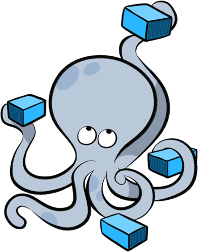
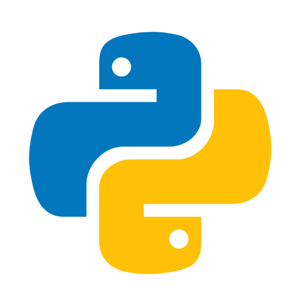

# 👨🏻‍💻 Luiz Inhesta

**`Cloud & Infrastructure | DevOps | FinOps`**

Sou especializado em Infraestrutura, Cloud (AWS, Azure e GCP), DevOps e Segurança. Tenho experiência com ambientes multi-conta, governança, automação em escala e integração entre arquiteturas on-premise, cloud e híbridas.

Atuo como líder em projetos de infraestrutura e cloud, conduzindo iniciativas de modernização, observabilidade, segurança, implementação de pipelines CI/CD e padronização de ambientes corporativos.

Tenho experiência sólida com monitoramento, segurança e conformidade em ambientes Windows, Linux e macOS, além de atuar com gestão de identidades, arquitetura de redes, alta disponibilidade e boas práticas de governança.

  
  
    
     
    
    

---
### 📺 Latest YouTube Videos

<!-- BEGIN YOUTUBE-CARDS -->
)

<!-- END YOUTUBE-CARDS -->

---
### 🏆 Conquistas & Certificações

---
### 🌩️ Cloud 

 
 
### 🖥️ Sistemas Operacionais

 
 
### 💻 Virtualização

 
 
### 🧱 Containers

 
 
### ☸️ Orquestração

 
 
### ⚙️ DevOps / Automação

 
 
### 🌐 Web

 
 
### 🧩 Ambiente Corporativo

 
 
### 🧑‍💻 Linguagens

 
 

